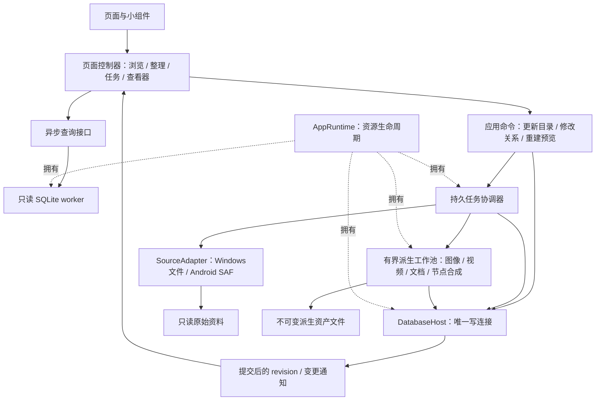

# Best Viewer 整体审视与重构方案

> 历史说明：图索引功能已在 schema 8 中删除。本文保留当时的评审内容，不作为当前产品功能说明。

日期：2026-09-14。状态：评审方案，尚未执行业务重构。

## 1. 结论与评审边界

**建议继续使用 Flutter + Dart + SQLite + 少量平台原生代码，采用渐进式重构，不推倒重写。**

项目已经形成明确价值：不修改原始资料，在 Windows 和 Android 上浏览大型本地资料库，支持目录来源、手工整理、图片视频沉浸浏览及离线预览。真正需要修正的不是技术栈不够先进，而是几项核心规则没有贯穿所有调用路径：任务恢复依赖隐式推断、数据库访问边界不完整、派生资产缺少统一版本与发布协议、部分浏览策略与十万级规模矛盾。

近期大文件拆分值得保留，但它主要改善了可读性。`part of`、mixin 和公开的 `database.db` 仍让多个模块共享内部状态。下一步应从“按文件拆分”转向“按状态所有权、事务边界和功能接口拆分”。

### 本次核查范围

- 实际 Git 仓库为 `D:\project\learn-myself\best-viewer\app`，当前 HEAD 为 `24c3f8e`，评审包括现有未提交修改与新拆分文件。环境给出的 `D:\project\best-viewer` 不存在。
- 阅读了应用启动与关闭、目录枚举、任务持久化、实体写入、节点关系、预览生成、浏览读取、缓存、查看器、阅读器、导航、日志和 Android/Windows 适配的关键链路。
- 本次运行 `flutter analyze --no-pub`：通过，25 秒。
- 本次运行 `flutter test --no-pub --reporter expanded`：49 项通过，2 项失败。测试进程设置了仅作用于该进程的 localhost 代理绕过。
- 失败之一：主界面测试实际触发侧边栏底部溢出 292px，并且还存在旧导航图标断言失效。
- 失败之二：Windows WIC 测试返回 null。测试所需的原生 DLL 未在当前加载候选位置找到，因此不能据此判定已安装 Release 的解码功能损坏；原生集成测试的构建前置条件和错误可观测性存在缺口。
- 本次没有连接平板执行 13 万文件扫描、没有测量 Release 帧耗时、没有检查平板最新数据库，也没有重新构建安装包。下文对性能收益的描述是代码机制分析，验收数值是目标，不是实测结果。
- 未将旧对话中“已经修复”的表述当作当前代码正确性的证据。此报告不宣称排除了所有缺陷，也不是逐依赖的完整安全审计。

## 2. 按影响排序的问题清单

分级：P0 是可能损伤已提交资料关系或误扩大更新范围；P1 是影响恢复、响应、正确显示或长期稳定性；P2 是维护、产品和发布债务。代码位置以本次工作区为准。

### P0-1：清单恢复按数量跳过，不能保证扫描完整性

证据：[library_build_task_controller.dart:329](../lib/src/core/controllers/library_build_task_controller.dart#L329)。本地重新执行 `Directory.list(recursive: true)`，Android 重新启动扫描，再跳过前 `manifestItemCount` 个支持的文件。写入阶段另外用 `indexedTotal - 1` 推断游标。

目录枚举顺序没有稳定性保证。暂停期间新增、删除、重命名或提供方改变返回顺序，都可能让“前 N 项”变成另一批文件。清单以路径去重，但序号可被覆盖；按序号分页又假设序号能代表稳定进度。最终对账把“未看见”解释成“已删除”，会放大清单不完整的后果。

**改法：**持久化待枚举目录、已完成目录和稳定工作项 ID；未完成目录允许重枚举并幂等合并，不按全树 ordinal 跳过。写入游标和业务计数分开保存；只有有完整覆盖证据的范围才允许对账移除关系。

### P0-2：Android 查询不到目录时被当作扫描完成

证据：[MainActivity.kt:798](../android/app/src/main/kotlin/com/bestviewer/best_viewer/MainActivity.kt#L798)。`openNextDirectory()` 先从队列移除目录，`contentResolver.query(...)` 返回 null 后直接 `continue`。最后仍可能返回 completed。

提供方暂不可用、TF 卡异常等情况下，null 不能代表“目录为空”。当前行为可把不可读子树当成已完整扫描的空子树，从而在对账阶段移除应用内关系及无引用实体。这里指数据库资料损失，**不是发现了删除原始文件的代码**。

**改法：**区分权威空结果、读取失败、授权失效、源离线、部分完成；不完整目录保留旧结果，标记阻塞并重试。只有成功枚举到末尾的目录才产生覆盖完成记录。

### P0-3：任务范围依赖可被置空的外键，存在范围扩大的条件

证据：[app_database.dart:240](../lib/src/core/database/app_database.dart#L240)、[library_build_task_controller.dart:673](../lib/src/core/controllers/library_build_task_controller.dart#L673)。任务的 `target_node_id` 使用 `ON DELETE SET NULL`；执行中多处用 `targetNodeId ?? rootId` 或 null 判断“整个根索引”。

当暂停任务的目标节点被另一轮更新、根替换等操作删除，目标置空可能把原本的局部任务解释为根任务。特别是已有子树清单恢复到 finalize 时，不能允许它拿局部清单对账整个根。并非每次删除都触发，但当前模型未排除这条路径。

**改法：**任务意图与目标定位不可变。保存明确 `scopeKind`、源 ID、相对目录/文档 ID、创建时目标 revision；目标丢失应进入“目标已变化”，不能退回根节点。每次执行和提交都验证作用域。

### P1-1：Android 仍有全树计数加第二遍枚举

证据：[MainActivity.kt:164](../android/app/src/main/kotlin/com/bestviewer/best_viewer/MainActivity.kt#L164)、[candidate_source.dart:136](../lib/src/core/scanner/candidate_source.dart#L136)。`startDirectoryTreeScan()` 先 `countDirectoryTree()`，随后创建新的扫描会话给 Dart 拉取清单。

计数阶段实际也通过 `DirectoryScanSession.nextBatch()` 构造文件元数据，只是不保存。随后再读取相同目录。计数包含非支持文件，而 Dart 清单过滤格式，前后分母语义也不同。取消请求排在同一扫描执行器上，长计数没有贯穿的取消检查。

**改法：**删除独立全量计数，枚举与清单入库合并一次。清单完成前显示“已发现 X 项、已枚举 Y 个目录”，采用未知总量进度；完成后冻结支持项总数。没有提供方现成索引时，“预先精确总数、只遍历一次、不保存清单”不能同时成立。

### P1-2：单写者只实现了一部分，主线程仍执行 SQLite

证据：[library_write_worker.dart:11](../lib/src/core/database/library_write_worker.dart#L11)、[library_build_task_controller.dart:673](../lib/src/core/controllers/library_build_task_controller.dart#L673)、[thumbnail_service.dart:228](../lib/src/core/thumbnails/thumbnail_service.dart#L228)。

实体页部分批量写入已经进入 worker，但任务 claim/完成、节点创建、统计、收尾对账、缩略图状态及资产记录仍有同步调用。主线程与 worker 拥有写连接，`busy_timeout` 为秒级，冲突时同步等待会直接占用 UI 时间。`async` 方法包装同步 SQL 不会使它自动离开 UI Isolate。

收尾还把整份清单路径读入 Dart List，再转 Set/List，再重新插入临时表；十万级清单产生重复分配和串行工作。`rebuildIndexNodeStatsForNode` 实际可重算整个根，名字掩盖了成本。

**改法：**数据库连接只在 DatabaseHost 及只读 worker 内创建。任务领域操作在 host 内完成事务，前端只接收紧凑 DTO。对账在数据库内直接关联持久化清单，不往返搬运全部路径。

### P1-3：worker 异常退出可能永久等待

证据：[library_write_worker.dart:23](../lib/src/core/database/library_write_worker.dart#L23)。启动等待 `readyPort.first`，请求等待 `response.first`，缺少错误/退出监听与等待终止机制。数据库打开或初始化出错时，UI 可能一直等待。

读 worker 已有启动错误、退出检测和超时，是值得保留的改进，但运行期请求也应统一监督。

**改法：**统一 worker 生命周期，登记 pending 请求；异常退出立即使所有 pending 请求失败。超时表示结果未知，不等于事务没有提交；写入必须带幂等请求 ID，查询结果后再决定重试，不能盲目再写。

### P1-4：批量写入存在语义重复与无效更新

证据：[library_build_task_controller.dart:652](../lib/src/core/controllers/library_build_task_controller.dart#L652)、[entity_repository.dart:45](../lib/src/core/database/entity_repository.dart#L45)。两个路径分别维护实体未变化判断和 SQL。任务路径对需要生成缩略图的类型要求 `thumbnailStatus == none` 才认定未变，因此已有成功缩略图的图片会继续走 UPDATE，即使内容未变。

此外，[library_write_worker.dart:190](../lib/src/core/database/library_write_worker.dart#L190) 的 batch 逐条 `database.execute`，每条再 `SELECT changes()`；没有复用同一预编译 statement。把循环移动到 Isolate 解决阻塞，不等于消除了重复解析和写放大。

**改法：**只有一个实体 upsert/diff 实现，由单项和批量入口共同调用；单事务批量复用 statement，比较真正影响数据和派生结果的字段。包含名称/排序键一致性测试。

### P1-5：预览资产目录分片失效，实体写文件并非安全替换

证据：[thumbnail_store.dart:15](../lib/src/core/thumbnails/thumbnail_store.dart#L15)。取 key 前两字符分片，但实体 key 都以 `v6_` 开头，所以同版本实体图实际集中在 `thumbnails/v6/`。节点预览另放在一个平铺的 `node_previews` 目录。

`writeBytes()` 使用固定 `.tmp`，删除旧文件后再 rename；Android 对应写入也先删旧文件。并发相同 key 会争用临时文件；删除与 rename 之间中断会留下 DB 引用却没有文件。节点合成已经使用新路径发布，这是正确方向，应统一推广。

**改法：**按真正哈希分片，版本另作目录层；同一资产 key 单飞；临时文件唯一命名；新文件验证后，使用不可变新路径和数据库 revision 条件提交替换引用。旧文件延迟回收。现有缩略图库按旧路径继续读取，后台低优先级迁移，不全部重编码。

### P1-6：8KB 采样指纹被用于超出其能力的复用判断

证据：[file_fingerprint.dart:6](../lib/src/core/utils/file_fingerprint.dart#L6)、[thumbnail_store.dart:72](../lib/src/core/thumbnails/thumbnail_store.dart#L72)。当前指纹是文件大小 + 首 8KB 的 SHA-256；缩略图 key 又把它压成 FNV-1a 64 位。

真正需要担心的是**同样大小且首 8KB 一致的不同文件**，或只修改文件中后段。这属于采样不可区分，并非 SHA-256 随机碰撞。相同采样指纹可复用同一缩略图，出现串图或不刷新。实体自身仍以路径/ID区分，并不是整个实体表已按哈希去重。

**改法：**实体身份使用稳定 ID；8KB 只作快速变更线索，不作跨实体合并依据。资产 key 建议基于 `entityId + sourceRevision + recipeVersion` 的 SHA-256。可选增强采样/完整校验单独定义，强制重新生成必须绕过快速复用。不用修改时间作为身份；也不能声称只读 8KB 能检测所有同大小文件修改。

### P1-7：原图临时文件缓存缺少版本与使用租约

证据：[media_source_resolver.dart:64](../lib/src/core/media/media_source_resolver.dart#L64)。Android 会话缓存仅按 `entity.path` 命中，未比较实体内容版本。更新同 URI 的文件后，仍可能使用旧临时文件。

淘汰同步删除文件，没有正在阅读/解码的 lease；2GB 限制在复制完成后才执行，最新文件排除于淘汰之外，单个大文件仍可能超预算。原生 materialize 复制失败没有就地清理半成品的 finally。

**改法：**源缓存键包含 source revision，使用引用租约；复制前预估/保留空间，唯一临时路径、失败清理、启动孤儿清理。能由原生播放器/解码器直接读取 URI/文件描述符的路径不要整文件复制；压缩文档等必须 seek 的情况仍可使用受控暂存。

### P1-8：暂停/关闭未贯穿正在执行的预览工作

证据：[library_build_task_controller.dart:116](../lib/src/core/controllers/library_build_task_controller.dart#L116)、[library_build_task_controller.dart:830](../lib/src/core/controllers/library_build_task_controller.dart#L830)、[app.dart:246](../lib/src/app.dart#L246)。控制器暂停仅设置标志，调用 `ensureThumbnail` 时未传已有 cancellation token；dispose 只取消进度定时器。应用关闭 worker/DB 前没有明确等待构建任务退出。

底层缩略图取消测试通过，不代表上层索引任务已经正确接入取消。原生不可中断解码只能在边界停止，UI必须显示“正在暂停”，而不能先宣称已暂停。

**改法：**一个 Runtime 持有构建、源会话、播放器、worker；停止接收新工作，取消排队和可取消的原生读取，等待/隔离当前工作，提交边界状态，最后关闭数据库。每个回调检查 generation/revision，旧任务不得回写新状态。

### P1-9：节点脏标记为空实现，重试未覆盖依赖刷新

证据：[library_repository_base.dart:500](../lib/src/core/database/library_repository_base.dart#L500)。`markIndexNodePreviewDirty()` 是空方法，实体引用增删、节点修改、目录删除等路径仍调用它。

部分前端显式启动重建，不能保证所有入口都覆盖。例如目录删除收集了外部受影响节点，却只调用空脏标记；前端随后重载页面，没有调度这些节点合成图更新。

`retryFailedAssets()` 只把 failed 工作项置 pending。实体预览后来成功，但依赖它的节点工作项若此前 completed，不会因 `INSERT OR IGNORE` 自动重跑。节点描述与实际合成图可再次不一致。

**改法：**在变更事务内持久化脏节点/revision，去重并合并祖先，自底向上更新受影响部分；实体派生结果变化必须触发依赖失效。移除空兼容方法和“前端记得再重建一次”的约定。

### P1-10：预览任务伪装成目录更新，恢复按钮不匹配

证据：[library_build_task_controller.dart:182](../lib/src/core/controllers/library_build_task_controller.dart#L182)、[index_management_page.dart:549](../lib/src/ui/index_management_page.dart#L549)。节点预览重建使用 `subtreeRefresh`，自定义索引的 source 为 `index://...`。恢复卡仍提供“重新检查并更新”，会重置回目录枚举。

仅文档预览失败时，按钮条件没有包含 `documentPreviewFailed`，因此可能缺少“仅重试失败项”入口。

**改法：**显式任务类型与 capability 驱动按钮。预览任务没有扫描源的含义；目录重新检查创建新扫描代次；重试失败保留成功工作及依赖关系。完成但有派生失败使用“完成，有 X 项待修复”，不要把整个索引呈现为失败或不可浏览。

### P1-11：任务明细长期累积，计数更新成本随进度增长

证据：[library_build_repository.dart:69](../lib/src/core/database/library_build_repository.dart#L69)、[library_build_repository.dart:617](../lib/src/core/database/library_build_repository.dart#L617)。历史列表 limit 只是 UI 限制；完成/放弃不会清理全部清单和工作明细。反复全量更新可积累多份十万行清单。

每批完成后重新 COUNT 已完成/失败行，遍历成本会增长。在每批 B 项、总 N 项情况下，反复计算累计已完成集合的逻辑工作量可达到 O(N²/B)，索引会降低单次定位成本，但不会让大集合 COUNT 变成 O(1)。本次未测量该项在总耗时中的比例。

**改法：**状态转移与计数增量在同一事务中提交，幂等重放不重复累计；阶段结束做校验。完成任务保留摘要和失败信息，按保留策略清理成功明细；未完成任务不得按时间自动清掉。

### P1-12：全量缩略图预加载与有限内存互相冲突

证据：[collection_browser_page.dart:456](../lib/src/ui/collection_browser_page.dart#L456)、[app.dart:419](../lib/src/app.dart#L419)。进入节点持续分页读取全部缩略图路径，并 `precacheImage(FileImage(...))` 解码；Android 图片缓存设置为 5000 项、512MiB。

36 万像素 RGBA 约 1.37MiB/张，仅像素数据就使 512MiB 最多容纳约 372 张，实际还更少。5000 是数量上限，不保证容纳 5000 张。大节点全加载会把刚预载的图片逐步挤掉，消耗磁盘读取、解码和电量，并与构建争抢资源。

**改法：**保留无限容量离线缩略图库；取消“每次进入大节点必须全部解码”。优先可见区域，再按字节预算加载邻近少量内容；小节点可整体预热，大节点到预算即停。用户滚动不是必须触发下载/生成，只是调整已有资产的内存工作集。

### P1-13：浏览查询和选择命中仍有随资料量增长的成本

证据：[library_read_worker.dart:886](../lib/src/core/database/library_read_worker.dart#L886)、[collection_browser_page.dart:549](../lib/src/ui/collection_browser_page.dart#L549)。

递归浏览即使采用游标分页，每页仍构建整棵子树路径并分组去重，不等于每页只做 pageSize 的工作。手势选择维护累计 GlobalKey 映射，每次指针移动遍历全部已登记实体，而不是只命中可见卡片。

**改法：**直接节点查询保留现有 keyset；递归浏览采用会话级有界结果缓存，或按节点顺序分段读取加去重，按 subtree revision 失效。不要预先建设所有“祖先×实体”的全局物化表。选择命中仅登记可见元素，卸载/换范围时注销，利用布局几何定位。

### P1-14：阅读进度语义不完整

证据：[viewer_document_preview.dart:48](../lib/src/ui/viewer_document_preview.dart#L48)。章节从 0 初始化，存储只有 scrollOffset；用户选择另一章节后偏移的参照范围变化，却未保存章节标识。翻页布局又把页码写进同一 scrollOffset 字段。

**改法：**统一但带类型的 ReadingLocation：文档版本、章节 href/ID、段落/字符偏移；PDF 单独使用页码和页内偏移。滚动像素只是本布局的恢复优化值，不能当长期阅读位置。切换布局、字号和窗口宽度后仍落到相同内容附近。

### P1-15：元数据拆阶段后，旧解析结果仍可能被基础写入清空

证据：[library_build_task_controller.dart:1065](../lib/src/core/controllers/library_build_task_controller.dart#L1065)。`_inspectForIndex()` 对非音频只产生基础数据，正文摘录为 null；而 `_commitIndexPage()` 的 UPDATE 仍直接写入 `metadata_preview = details.$5`。已有文档摘录与 null 不一致会触发更新，导致普通更新先清空旧摘录，再通过后台文档阶段重做。

`prepareDocumentPreviewWork()` 又无条件选入 EPUB；EPUB/DOCX 封面阶段还可能重新暂存并打开同一压缩文档。Android 音频在基础检查时无条件先完整 materialize 再探测元数据，即使此前实体内容未变，也没有先根据快速指纹跳过昂贵探测。

**改法：**基础元数据和派生摘录的字段所有权分离，“本次未解析”不等于“解析结果为空”。内容版本未变保留旧摘录/时长；变化时将旧结果标 stale，但新结果成功前可以继续显示。先轻量判断再安排音频探测；文档一轮解析同时输出摘录/封面，不恢复成索引主阶段串行解析所有文档。

### P1-16：基础检查缺少逐项失败持久化

证据：[library_build_task_controller.dart:473](../lib/src/core/controllers/library_build_task_controller.dart#L473)。一页文件并发执行 `_inspectForIndex()`，单个 stat/读取指纹/音频探测异常会向上抛出，整页尚未进入提交。现有“仅重试失败项”的三个表只覆盖派生阶段，不能表达基础检查失败的那个文件。

**改法：**检查返回逐项 outcome，成功项提交，失败项持久化到 scan_items；普通损坏/不可读文件不终止全部批次。源授权丢失、源离线等系统性错误则阻塞任务。对账必须区分“看见但读失败”和“完整枚举后确实缺失”，前者保留旧实体，不因检查失败删除。

### P2：产品与工程交付债务

| 项目 | 当前证据/问题 | 建议 |
|---|---|---|
| 侧边栏高度 | [app_sidebar.dart:99](../lib/src/ui/app_sidebar.dart#L99) 仅小于 520 才滚动；本次测试 542 高时溢出 | 按可用空间滚动，底部设置固定；不使用硬编码入口总高度假设 |
| 索引管理三列 | [index_management_page.dart:256](../lib/src/ui/index_management_page.dart#L256) 固定 3 列、shrinkWrap | 最大 3 列，依可用宽度降到 2/1 列；单一 Sliver 滚动容器 |
| 点击区域 | 折叠栏 36 宽、部分按钮 30 高 | 视觉保持紧凑，触控命中区 44–48dp；边栏可折叠，不必在 Android 改底部导航 |
| 配置持久化 | [app.dart:64](../lib/src/app.dart#L64) 主题及 BrowserState 主要在内存 | 持久化主题、布局、排序、密度；会话选择状态不持久化 |
| schema 升级 | [app_database.dart:99](../lib/src/core/database/app_database.dart#L99) 不兼容即要求清库 | 开发期清库许可不应成为发行版升级政策；自定义树、图、封面选择、阅读位置不可重新扫描还原 |
| 原生诊断 | WIC catch 后返回 null，测试未准备 DLL | 保留错误分类与 backend 信息；原生契约测试前先构建 DLL |
| 发布签名 | [build.gradle.kts:35](../android/app/build.gradle.kts#L35) Release 使用 debug key，版本 `0.1.0+1` | 独立发布签名、连续版本号、兼容升级验证；换签名前规划现有安装数据保留 |
| 文档与仓库 | app README 仍是 Flutter 模板，父目录 docs 在当前 Git 根外 | 项目说明、架构决策、构建与验收脚本放进实际仓库，避免文档与代码不同步 |
| 日志 | 已有轮转、尾部限量读取，是有效改善 | 保留；补关联 ID、阶段耗时、worker 心跳，不默认记录每张成功图片的完整信息 |

## 3. 产品边界：保留什么，收敛什么

建议定位为：**面向大体量本地图片、视频和文档的离线资料浏览器。** 手工整理服务于找回与浏览资料，不扩展为通用知识平台或创作软件。

| 能力 | 决策 | 原因及处理 |
|---|---|---|
| 目录来源、局部更新、暂停恢复 | 核心保留 | TF 卡十万级规模的基础能力，最高优先级 |
| 自定义树、批量引用、深拷贝节点树复用实体 | 核心保留 | 有用且语义明确；不复制源文件、不重复实体内容 |
| 图片/视频沉浸浏览、返回浏览位置 | 核心保留 | 是项目体验优势，保留背景和滚动位置，简化叠层实现 |
| 全量离线实体与节点预览 | 核心保留 | 应用支持目录持久存储；不设 LRU 容量淘汰，空间不足阻塞新生成 |
| 最近浏览、视频进度、阅读位置 | 保留并统一 | 保存的是用户数据，不能因重建预览或升级丢失 |
| 音乐播放 | 保留基本功能 | 队列、后台播放、音量、进度足够；统一播放服务和焦点管理 |
| 桌宠、语音、动作绑定 | 建议从主产品删除 | 分散页面和任务生命周期注意力，增加交互矩阵；资源仅约 1.23MiB、25 个文件，删除主要降低维护复杂度，不要宣传成明显省空间 |
| 图索引 | 保留数据、降为实验功能 | 暂停扩展布局算法；作为手工资料集的画布视图逐步收敛，旧图关系/坐标不能直接删除 |
| 音乐双波形/双进度装饰 | 收敛 | 保留一个权威 seek 状态，可选一个轻量波形；减少同时动画和重复交互面 |
| 自适应 MaxRects 布局 | 实验开关，冻结算法迭代 | 不否定现有算法，但不能为填满空白牺牲排序可理解性、虚拟化和稳定性 |
| 等高、等宽、列表 | 默认布局保留 | 等高默认适合混合横竖图；列表适合定位和整理；方格放次级选项 |
| 节点预览实时拼多图 | 删除视觉拼图的重复实现 | 有图节点统一磁盘合成；纯音频/文本保留低成本实时文本卡 |
| 进入节点全量预解码 | 建议取消硬性要求 | 与有限内存冲突，改成预算内预热；不删除磁盘预览 |
| 搜索、索引包导入导出 | 继续不做 | 遵循既定范围，不借重构重新加回 |
| 恢复备份 | 建议补最小能力 | 是保护用户数据库的系统功能，与分享索引包不同；若暂不做 UI，至少提供可验证的维护工具 |
| iOS、云同步、AI分类、全局去重 | 延后 | 会扩展持久任务、授权、数据同步边界，现阶段收益低于可靠性 |

旧功能下线前先解除 AppShell 绑定、移除入口和资源注册，再删除实现、依赖与测试。图功能应先隐藏创建入口并保留现有数据读取，确认使用情况后决定是否进一步下线。

## 4. 必须长期成立的系统规则

1. **原文件只读。** SourceAdapter 只提供枚举、metadata、prefix/stream/descriptor；不暴露写入/删除 API。Android 不再请求不需要的写授权；平台 grant、文件路径与应用存储路径分别建模。
2. **用户整理结果不是缓存。** 自定义树、图关系、封面选择、播放/阅读状态是需要迁移和备份的用户数据。
3. **离线预览不是可随意清理的浏览缓存。** 它们放 application support/files；浏览解码缓存受字节预算约束；原图暂存另有容量与 lease。
4. **未扫描到不等于源不存在。** 源离线、权限错误、部分扫描不能触发删除对账。
5. **已提交数据与任务剩余工作分开。** 暂停和放弃都不回滚已提交资料；任务不会凭状态推断出另一个作用域。
6. **数据库只有一个写入者。** 原生线程只读源、写 app-owned 派生文件，不绕过 DatabaseHost 修改关系。
7. **预览是有版本的派生结果。** 旧结果在新结果提交前保持可用，失败不会删除旧结果；旧任务不能覆盖新版本。
8. **页面显示是查询快照。** 页面不承担修库、自动启动补丁扫描或资产回收职责。
9. **异步操作必须能结束。** 成功、失败、等待条件、取消请求均有明确结果；worker 死亡不允许永久 Future。
10. **规模受预算约束。** 每页、并发任务、待写结果、解码字节、日志读取、递归结果缓存都有独立上限。

## 5. 目标架构：模块化单体，有限的异步边界



### 模块与边界

| 模块 | 独占职责 | 不允许 |
|---|---|---|
| AppRuntime | 启动、恢复检查、后台/前台、关闭顺序，注入依赖 | 拼装页面业务、执行业务 SQL |
| LibraryQueries | 节点列表、实体分页、详情、统计快照 | 返回数据库句柄，查询时修复资产 |
| LibraryCommands | 创建/重命名/复制/移除引用、目录移除计划 | 直接让页面手写 SQL |
| BuildCoordinator | 持久任务状态、scope、领取/完成/恢复、暂停 | 渲染 Widget、把计数当游标 |
| DatabaseHost | 唯一写连接、事务、约束、预编译 SQL、幂等命令 | 文件解码、跨 await 持有事务 |
| SourceAdapter | 只读枚举和读取；准确报告授权/可用性 | 删除源、理解索引业务 |
| PreviewPipeline | 输入版本、处理 recipe、生成临时资产、结果验证 | 自行修改实体业务属性 |
| MediaSession | 播放/查看/阅读状态、源租约、原图窗口 | 创建索引、任意清空全局图片缓存 |
| Diagnostics | 结构化记录、聚合指标、失败项查询 | 替代任务状态数据库 |

可以先使用手工依赖注入、ChangeNotifier/ValueNotifier 和不可变页面状态，不必同时迁移 Riverpod/BLoC。只有出现实际跨模块状态组合困难，才按一个页面试点状态框架。更换框架不能自动解决 SQL、原生生命周期或恢复语义。

建议目录按 `features/library`、`features/build`、`features/viewer`、`features/collections`、`features/diagnostics` 和 `infrastructure/database|sources|media` 收拢。不是每个类都要 interface，也不建立十层通用 Repository。已有 `part of` 可以作为过渡；优先抽离拥有资源或事务的对象，纯 UI helper 不必强行拆独立库。

`MainActivity` 最终只注册 channel、转交权限和生命周期事件；SAF、缩略图、暂存各自独立 Kotlin 类。Dart/native DTO 可考虑 Pigeon 生成类型桥，先迁一个高频接口，避免同时改所有插件调用。

## 6. 数据模型与数据库方案

### 6.1 三类存储，不必拆成三个数据库

| 类别 | 内容 | 策略 |
|---|---|---|
| 权威记录 | 来源授权定位、实体身份、手工节点/引用、图位置、阅读/播放状态、预览选择 | 迁移、恢复备份；不可自动清库 |
| 派生数据 | 扫描元数据、实体预览、节点封面、统计、文本摘录 | 可重建但成本高；版本化、增量、孤儿回收 |
| 临时数据 | 解码内存、原图暂存、解析工作文件、运行期页缓存 | 各自预算；lease 与失败清理 |

继续一个 SQLite 文件，避免多个数据库之间无法原子提交关系。实体和节点仍是核心概念，不另建一份“实体缓存数据库”。

### 6.2 最小新增结构

- `sources`：稳定 sourceId、平台、tree URI/本地根定位、显示名称、授权与在线状态。目录索引根关联 sourceId，不把 URI 字符串前缀当通用层级关系。
- `entities`：保留稳定 entityId，增加 sourceRevision/metadataRevision 的明确定义。当前 source locator 可变；实体和内容相同与否是两个概念。保留主目录归属与多节点引用这两个不同关系。
- `library_build_jobs`：明确 kind、scope、scanGeneration、status、stage，持久化不可变目标定位；失败类型不挤进一个 error 字符串。
- `scan_directories`：jobId、目录 locator、状态/attempt、是否完整覆盖。提供方游标不作为跨进程持久令牌。
- `scan_items`：稳定 work ID、jobId、源 locator、扫描代次、inspect/write 状态及异常；唯一 `(jobId, locator)`，不要依赖外部枚举序号唯一。
- `preview_work`：三个派生工作表结构相近，可合并为带 kind 的同构队列表；清单和目录队列保持独立，不做万能 JSON 工作表。
- `node_preview_dirty`：nodeId、desiredRevision、原因/更新时间；相同节点合并，提交时比较 revision。
- 资产登记：owner、sourceRevision、recipeVersion、path、宽高/大小、状态、创建时间；复用现有资产表逐步补字段，不要求一次全面范式化。

如果合并 work 表，需要以 entity/node 外键或明确 payload 表保持引用完整性，不能只剩一个无约束 subjectId。图的边与树的 parent 关系继续分离，图有环不等于树允许有环。

### 6.3 SQLite 性能措施

1. DatabaseHost 提供 `commitManifestPage`、`commitInspectedPage`、`claimPreviewWork`、`commitPreviewBatch`、`reconcileScope` 等领域命令；UI不发散落 SQL 字符串。
2. 查询用 DTO 投影，列表不默认 `SELECT *` 携带长摘录和额外状态。worker 消息设置最大页尺寸。
3. 预编译语句按连接复用，批量参数直接执行。数据库事务内不读 TF 卡、不压缩图片、不等待 channel。
4. 资料写入+工作项状态+计数在同一事务完成；task计数是可校验投影，不能成为唯一恢复依据。
5. 保留 WAL。优先解决长读事务、写放大和 writer 竞争，再根据真机 WAL 指标决定 checkpoint 节奏；不要每张图强制 checkpoint。
6. 用 `EXPLAIN QUERY PLAN` 验证名称排序、关联查询、递归分页、待处理领取。`entities.path` UNIQUE 与单列索引、关联表复合主键左前缀与单列索引可能重复，验证实际计划后移除。
7. 大范围对账分为增量准备和明确提交；删除关系要与“已完成覆盖”关联。避免为了一个巨大事务长时间阻塞所有前台写命令。
8. 统计先保证正确，再做局部：直接实体数可增量，含跨节点重复引用的递归实体数不能简单对子节点求和。只重算受影响根/祖先并合并请求，不建全局昂贵闭包表作为默认方案。

### 6.4 文件身份与变更检测

默认保留低成本采样模式，但把它明确命名为“快速指纹”，与完整内容哈希区分。快速扫描无法保证发现文件末段所有变动，这一点必须体现在产品行为和测试中。

推荐默认不做不同实体之间的资产复用。自定义节点共享同一个 entityId 已经避免了大多数重复生成。只有将来确实测得内容重复占用很高，再在完整哈希可用时增加可选跨实体去重。

支持 provider seek 时可用首/中/尾增强采样，但它仍不是完整校验，且 TF 卡随机访问会有代价。提供“强制重新生成所选预览”和低优先级完整校验作为修复路径；本轮不要强制全库读取 2TB 原文件。

本地重命名/移动若有稳定文件 ID 或可靠 source locator 可保留实体身份；无法唯一识别时按新增/缺失提示用户，不凭采样指纹自动合并两个不同文件。

## 7. 统一构建、更新、恢复和删除语义

### 7.1 保留可理解的阶段，不引入通用工作流引擎

```text
校验来源与作用域
  -> 枚举并持久化清单（一次遍历）
  -> 读取快速指纹/必要元数据 + 批量写入实体和关系
  -> 对账提交（仅覆盖完成的范围）
  -> 文档摘录/封面解析
  -> 实体预览
  -> 节点描述/合成预览
  -> 摘要与工作明细整理
```

这是逻辑阶段，不要求文件每经过一行就再完整打开一遍。EPUB/DOCX 在一个解析会话里输出摘录和封面，交给两个下游消费者；PDF 只取需要的文字/页面图，不遍历全书为了 500 字。

清单阶段结束后才有准确总数。元数据写入的已提交内容应可浏览；对账尚未完成显示“更新中”，旧已提交资料继续可见。可以保留 `is_staging` 作为内部发布机制，但不要把“还有几张预览失败”当成隐藏整个根的条件。

### 7.2 任务 kind 与状态分开

推荐 kind：`scanScope`、`rebuildPreviews`。根扫描/局部更新由显式 scope 区分；“重试失败项”是对既有工作项的命令，不需要再发明一套任务类型。

推荐状态：pending、running、pauseRequested、paused、blocked、completed、completedWithErrors、abandoned。stage 表示在做什么，status 表示现在能否推进。failed 工作项与 blocked 整个任务分开；一个损坏视频不应阻止其它 129999 项完成。

| 用户动作 | 必须产生的行为 |
|---|---|
| 暂停 | 停止派发，尽力取消读取/解码，提交已完成批次，进入 paused；不能清空已提交资料 |
| 继续 | 校验同一 scope，直接领取剩余工作；恢复期间立即展示已持久化进度 |
| 放弃任务 | 标记不再调度，保留已提交实体/节点/资产；只清理该任务临时资源 |
| 重新检查并更新 | 明确新扫描代次，可再枚举；旧可浏览内容保留。不能偷偷冒充“继续” |
| 仅重试失败项 | 重置相关失败工作并刷新成功后依赖；不重新扫描源目录 |
| 重建节点封面 | 只更新节点描述/合成资产，不允许“重新检查目录” |
| 移除手工节点/引用 | 修改应用关系和对应派生结果，源文件不动 |
| 移除目录来源 | 先展示影响范围与外部引用；确认后的命令内再次校验。拒绝冲突或明确连同相关引用移除；原文件不动 |

来源暂时离线保持 entities 与手工引用，仅改变 availability。完整扫描确认源条目缺失时，从目录关系移除；其它手工引用可保留为 unavailable 占位并给出清理入口。若要改变当前“未被其它引用则清理实体”的策略，需要明确产品选择，不能在重构中悄悄变化。

重叠目录注册建议默认拒绝重复来源，并给“打开已存在来源 / 更新其中子目录”。若保留扩大根目录能力，做一个显式“调整来源范围”命令和影响预览，不与普通新增自动混合替换。

### 7.3 持久化粒度

- 枚举清单每页提交，同时提交发现的子目录队列；完整目录标记与页结果要能幂等恢复。
- 索引页保留最多约 200 项的读取/解析批次，8 并发为初始上限而非恒定最优值；SQL 事务与工作状态一起提交。
- 派生结果每最多 100 项或时间阈值提交；暂停、阶段结束、正常关闭时立即提交不足一批的结果。大型节点合成可用更小计算批次，计算批次不等于恢复提交粒度。
- 进度推送沿用已有约 150ms 节流，持久化频率与 UI 刷新频率解耦。
- 崩溃后将 processing 重置为可恢复，但先按 asset receipt/revision 识别已经发布的结果，避免重复编码整个批次。
- 数据库 WAL 的 NORMAL 模式可保护常见进程崩溃一致性，但不能承诺每次突然断电都保留最后一次事务；根据是否需要断电耐久性单独测试/选择同步级别。

### 7.4 Android 长任务

当前执行器依赖 Activity，清后台可终止工作。第一目标应是“随时中断能恢复”，其次才是“尽量后台持续”。

前台开始的长构建可增加带通知的 Android 执行宿主与合法唤醒管理；具体 foreground service 类型、后台启动限制和目标 SDK 时限需要按当时 Android 规则验证。不能用一个 WorkManager 名字就承诺十小时永不停止。所有宿主共用同一个队列/写入边界，不让 Kotlin 与 Dart 各自实现一套扫描状态机；即使系统强停也从数据库恢复。

## 8. 预览与资源管理方案

### 8.1 三套预算各管各的

| 存储 | 内容 | 限制与清理 |
|---|---|---|
| 离线预览库 | 完整实体 WebP、视觉节点合成 WebP | 无容量 LRU；按有效引用和版本回收孤儿，空间不足停止生成并保留旧图 |
| 浏览内存 | 当前/邻近卡片及当前原图的解码结果 | 字节优先、条目上限辅助；memory pressure 时降低预热 |
| 原文件暂存 | 必须本地 seek 的 SAF 文档/图片临时文件 | 容量预约、活动 lease、失败清理、启动清理；不可删除正在使用文件 |

原图“最多六张”应作为数量上限，再加总字节预算。多张 8K RGBA 图加视频纹理可能远超预算；不能因为小图场景能预留六张，就保证所有原图都常驻。ImageCache 统计也不是进程 RSS，更不包含全部 GPU/native 解码内存。

### 8.2 统一资产协议

```text
领取任务（owner + sourceRevision + recipeVersion）
 -> 读取只读源
 -> 原生下采样/文档解析/合成
 -> 写唯一临时文件，得到实际尺寸与结果
 -> 验证可用性并发布不可变文件
 -> 单事务比较期望 revision，更新 asset 引用 + 完成工作项
 -> 提交后通知页面；旧版本进入延后回收候选
```

DB 与文件系统不能做真正跨系统原子事务，因此主动选择可恢复的“先文件后引用”：中途崩溃最多留下孤儿新文件，不应留下新 DB 引用指向尚未生成的文件。掉电级保障还需考虑文件 fsync、目录持久化及平台差异。

建议路径 `previews/entities/<recipe>/<hash前2位>/<完整key>.webp` 和 `previews/nodes/<recipe>/<hash前2位>/<完整key>.webp`。根目录/节点名不参与物理路径，重命名和深拷贝不会移动整棵预览库。

recipe 包含目标像素/高度、quality、方向处理、透明底色策略、封面拼接版本；不能仅比较实体 key 就判断节点封面无需刷新。内存 ImageProvider 键也必须含资产版本，避免新图生成但旧图仍命中。

逻辑派生 key 与物理发布 ID 分开：key 用于判断需要什么结果、合并相同任务；每次实际替换产生新的 publicationId/不可变路径。强制重建即使采样指纹未变也推进派生请求 revision，从而既绕过复用又不覆盖正在显示的旧文件。

### 8.3 保留现有效果，修正生成边界

- 实体图片：保留目标约 360000 像素、原比例、WebP quality=80 作为当前基线，不把换 AVIF/全库重压缩作为本轮重点。
- 原图来源优先，不重新引入 Android 系统低清缩略图缓存作为生成源。下采样必须处理 EXIF 方向，宽高取实际解码结果。
- 节点：保留实际叠放规则、0.4H 下层可见宽、已确认的阴影/裁剪样式。视觉节点在后台一次合成，不每张卡实时处理多个文件。
- 文本/音频节点：实时文本卡合理；不为了“所有预览统一文件格式”把文字栅格化。
- 文档：第一张有效图片优先；无图时前 500 字+省略号。readyText/noCover 是成功的终态，不能等同未生成而每次重试。
- 自定义封面顺序是用户数据；封面缺一张可显示旧图/失败状态，不自动覆写用户选择。
- 对图像解码、压缩包条目数量、单条解压大小和总缓存字节建立限制；当前 ArchiveSession 仅 8 条数量限制不能约束大条目的字节占用。不要把普通大文件误判成格式错误，提供明确“资源限制”结果。

### 8.4 有界调度而不是不断加并发

图片、视频、文档有独立并发上限，共享源读取/内存预算。浏览原图优先，后台预览退让；TF 卡场景先采用保守图片 4、视频 1，再根据吞吐、等待、帧时间和温度升降，Windows NVMe 可以更高。

记录 open/read、decode、resize、encode、write、DB wait 的阶段耗时；若某原生接口无法分离 read/decode，就标注合并阶段，不输出虚假的精确数据。Android 先保留现有原生写 WebP 和 scaled video frame；Windows 不要求为架构统一放弃 WIC。

## 9. 前端整体调整

### 9.1 导航与信息架构

保留 Windows/Android 侧边栏。推荐一级结构：

```text
资料目录
资料集
最近浏览
任务
------------
设置
```

“资料集”默认是手工树；图画布是实验视图。“最近浏览”内保留视频/图片/阅读/音乐分类，最近数据的语义不改成全库媒体。若用户确实高频切换，可把媒体分类固定到侧边栏，作为可选快捷项，不再强制所有人同时承受 12 个入口。

首页欢迎大图移至首次使用/空状态；日常默认恢复最后浏览位置。统计、来源状态放资料目录顶部小摘要；开发日志移到“设置 > 诊断”，运行任务在一级导航。新增来源、重命名、更新和移除回到对应来源的工具菜单，不再维护一个与浏览树重复的庞大索引管理页。

术语建议：用户界面把“实体”多写作“文件/资料”，“目录索引”写作“资料目录”，“自定义索引”写作“资料集”，“节点”按场景写“目录/分组”。开发文档保留 Entity/IndexNode 精确术语。批量按钮明确“加入资料集”“移除引用”，目录来源的移除对话框明确“不删除原文件”。

### 9.2 浏览页

- 顶部左侧是来源/路径，右侧只保留“选择、沉浸、视图选项”；二级操作放溢出菜单，选择模式出现文字操作栏。
- 列表节点不显示大预览，遵循现有偏好；显示图标、名称、计数和状态，背景与页面一致，横线分隔。
- 大屏最多 3 列列表，小窗口/分屏按最小可读宽度降列。节点与实体使用一致的行高规则，但不强行让每类操作按钮数量相同。
- 网格节点保留等高封面；实体布局影响实体，不重新引入“所有类型必须同一个复杂排版算法”的要求。
- 等高图行：确定一行后锁定布局，翻页追加不重排已浏览区域；窗口变化才重排。MaxRects 放实验，不为了减少少量空白耗费长期维护。
- 选择模式全选要明确“已加载”还是“当前范围全部”；支持全范围选择时用 query scope + 排除集合表示，避免拉取十万 Entity 对象。批量操作执行时冻结范围/revision并显示实际影响数。
- 单节点选择显示封面自动重建/自定义选择；选择候选保持树形浏览，支持递归进入与明确选择顺序。

### 9.3 查看器与播放器

使用一个 ViewerSession 和明确分层：保留的浏览内容 -> 背景遮罩 -> 图片/视频主内容 -> 右侧详情 -> 工具栏/音乐抽屉。遮罩不抢工具栏命中，主图以整个可用 viewport 为变换范围，退出恢复先前页面及滚动锚点。

图片区与视频区共用 ToolbarShell、按钮尺寸、折叠行为；各自通过 capability 提供播放/静音等独有按钮。退出查看器、返回原所在节点、定位源目录是三个不同动作，不能互相替代。上一个/下一个放工具栏末尾，保留用户已有习惯。

系统返回统一次序：关闭当前弹层/详情 -> 退出查看器 -> 退出选择/沉浸 -> 返回浏览上一级 -> 应用退出。桌面 Esc 与 Android back 复用同一导航意图，不能各自散落 bool 判断。

视频滑动进度区域保持可见的轻遮罩，命中只在进度区域内；整页手势不能吞工具栏点击。音量/播放焦点、耳机拔出/来电等平台行为由 MediaSession 集中处理。现有 MediaPlayerLifecycle 的 generation、幂等关闭应复用，不因文件拆分而重做播放器核心。

### 9.4 任务与诊断

每个任务是一张卡，阶段纵向紧密排列，阶段名左侧、进度/数量右侧。未知总量不用显示 `400/0`。任务刚恢复就展示持久化快照和“正在校验来源”，不要等慢枚举完成后才突然出现。

任务页保留可理解的四种行为，但按 capability 展示：继续、重新检查、仅重试失败、放弃。详细错误进入诊断；已完成摘要在历史区，不能挤在活跃任务中间。

诊断页保留现有尾部读取和轮转，改为任务/实体关联跳转。默认只显示错误、当前任务与最近摘要；成功记录汇总，详情分页。导出诊断默认隐去完整本地路径，用户主动选择附带。错误要能区分“源离线、授权失效、格式不支持、文件损坏、空间不足、原生失败、worker退出”。

## 10. 迁移、测试与发布

### 10.1 渐进迁移

先给当前工作区建立可验证基线，再实施增量 schema。用户曾允许清库，但该条件不能直接套用到现有十几小时构建成果和未来朋友的资料库上。

新增字段/表优先，旧接口适配新单一实现，禁止双写两套业务状态。每阶段独立本地 commit；回滚代码时，遇到更高 schema 不自动清库或强行降级。旧预览文件可继续读取，迁移位置与升级编码 recipe 分开。

最小备份应包含 SQLite 一致性快照、用户配置及实际被引用的派生资产清单。在线直接复制主 DB 文件会忽略 WAL；应使用 SQLite backup API/一致性快照。全量资产备份在 quiescent 窗口，或对引用资产建立保留租约再复制并校验数量/大小；恢复要验证外键、资产缺失和 SAF 重新授权。不要再把一个 DB 文件大小当作“所有缩略图都已备份”。

### 10.2 必须新增的测试

| 测试组 | 覆盖场景与断言 |
|---|---|
| 清单恢复 | 随机顺序、暂停期间增删改、重复页；最终清单不漏、不靠序号猜测 |
| 扫描失败 | SAF null、异常、TF拔出、授权撤销；旧范围不被误删 |
| 作用域 | 暂停后删除/替换目标；恢复只能拒绝或定位原范围，绝不扩大到根 |
| 故障注入 | 每个阶段/事务/文件发布边界杀进程再打开；提交结果不丢、未提交工作可重放 |
| 资产一致性 | 同 key 并发、旧任务晚返回、磁盘满、rename失败、更新原URI；不串图、不丢旧图 |
| 派生依赖 | 实体重试成功后节点封面自动刷新；手工移除引用/目录来源后相关封面失效 |
| 取消与关闭 | 慢原生任务、worker退出、dispose时构建中；Future有结果、无关闭后SQL |
| 阅读位置 | 跨章节、滚动/翻页互换、字号/窗口变化、重新打开；保持内容锚点 |
| UI | 600/720/1080高、Android分屏与字体放大；侧边栏无溢出、点击无遮挡、系统返回一致 |
| 平台原生 | 构建后测试 Windows DLL；真机验证 SAF、大图、方向/透明、5K视频；Dart单元测试不冒充原生验收 |

保留当前通过的 keyset、读 worker、队列取消、关系深拷贝、排版边界、文档解析和播放器生命周期测试。修正旧图标断言，同时保留溢出检查；不要只删除失败测试。

### 10.3 数据集与指标

准备 1千、1万、13万项三档：混合格式、宽深目录、大量同名文件、全音频/无封面EPUB、重复内容、相同首8KB不同尾部、异常文件。用合成目录/假源做恢复确定性测试，用真实 TF 卡做吞吐测试，二者不能互相替代。

记录：枚举项/秒、首次可浏览时间、实体/节点预览吞吐、源读取延迟、DB事务 p50/p95/max、WAL大小、待处理队列、Dart/native/GPU内存、磁盘离线资产/临时文件/日志分项、UI build/raster耗时及丢帧比例。

建议验收目标（待真机基线校准）：

- 点击后 100ms 内出现 UI反馈；恢复卡不等扫描返回才变化。
- 原生读取可中断时暂停在约 2 秒内推进到 paused；不可中断任务明确显示等待并可观察耗时，不作绝对 2 秒承诺。
- 60Hz 浏览优先保持帧预算约 16.7ms；在构建同时浏览时按测量动态限流，而不是只追求后台吞吐峰值。
- 活跃清单空间 O(N)，重复完成更新后不再累积 N×更新次数明细；增量计数每批工作量与本批相关。
- 反复打开/退出查看器 100 次、浏览多个大节点后内存应回落到稳定区间；不以 ImageCache.currentSizeBytes 代替整个进程内存。
- 随机中断恢复与源故障测试零作用域误删；完成计数、失败项、实际引用资产能相互对账。

### 10.4 可重复交付

版本管理 Flutter SDK、Dart/Gradle/AGP、依赖锁文件及原生工具获取校验。保留代理可配置，不把个人 Flutter 绝对路径写死进分发包；运行成品无需下载编译依赖。

CI/本地验证脚本分层：静态与纯Dart测试 -> Windows原生构建测试 -> Android构建 -> 平台冒烟。Release输出携带版本号、commit、构建日期、schema、recipe，诊断页可直接看到，解决“是不是没装上”的长期排查困难。

APK使用专用签名并保存密钥恢复流程；Windows先提供完整便携目录压缩包或现有安装器，验证不依赖开发机工具。正式公开发布前盘点 FFmpeg/media_kit 等实际分发二进制的许可证和告知文件，以及角色图片/语音资源授权；不要把资源全部混在应用主许可里。

## 11. 可执行实施顺序

以下是建议批次，不是本轮已授权执行的任务。每批完成后有独立验证结果再推进，不把所有架构修改塞进一个无法回退的大提交。

| 批次 | 主要工作 | 完成标准 |
|---|---|---|
| 0. 固定基线 | 保存当前拆分成果；修正测试入口/原生DLL前置；记录代码与schema/recipe版本；准备恢复测试源 | 静态与适用测试全绿，已知平台限制明确 |
| 1. 恢复止损 | null枚举阻断对账；冻结任务作用域；取消ordinal跳过；明确预览任务kind；失败按钮补文档项 | 源故障、目标变化、暂停/继续测试通过；不误删已提交关系 |
| 2. 数据库归一 | 实现受监督DatabaseHost；集中实体diff与领域事务；所有生产写入迁入host；移除主线程fallback | UI不持有sqlite句柄；死worker不挂起；重复更新减少无效SQL |
| 3. 构建流水线 | 删除预计数；目录frontier持久化；事务状态与显式工作项；增量计数、明细保留策略、取消链 | 一次枚举；各阶段可恢复；暂停/放弃语义一致；十万级内存有界 |
| 4. 资产和预览 | revision/key/路径分片；安全发布；统一脏标记/依赖刷新；文档单次解析；清理重复重建路径 | 并发/崩溃/重试不丢旧图；更新同URI看到新内容；无需全库重编码 |
| 5. 浏览与查看器 | 预算预热；递归查询会话优化；选择命中；源租约；阅读锚点；Runtime关闭 | 构建与浏览可并行；反复开关无持续资源增长；阅读正确恢复 |
| 6. 产品界面 | 删除桌宠；收敛导航与重复管理页；自适应列表列数；统一工具栏/返回；任务与诊断整合 | 双平台不同窗口无溢出，功能入口与任务能力一致 |
| 7. 发布收尾 | 正式迁移/恢复工具、签名与版本、基准数据、文档/依赖/许可证、Release冒烟 | 能向朋友交付可升级、可诊断的版本，不要求清数据重装 |

依赖：批次 1 可以先在现有结构内止损；批次 2 为 3/4 提供事务边界；批次 5 的缓存键依赖 4 的 revision；界面骨架可先修溢出，但大范围导航重组放在任务语义稳定之后。后台长期执行宿主建议在 3 稳定后单独做，不与扫描状态机同时大改。

单人完成整个方案可能跨多个迭代。建议先用批次 0–2 的实际改动量和真机测试成本再排工期；没有测量前不承诺某个固定天数或几倍提速。

## 12. 不建议做的“重构”

- 不为减少几千行 Dart 换成 Rust/C++ 全面重写，也不为十万记录换 PostgreSQL、图数据库或对象数据库。
- 不同时更换状态框架、数据库框架、播放器与导航系统。保留现有可测能力，逐边界替换。
- 不把每个 bool 升级为通用事件总线，不引入分布式队列、完整事件溯源或可编排 DAG 平台。
- 不为简化代码删除用户已投入时间生成的预览库，不把版本更新等同清库重扫。
- 不以无限加并发、加缓存条目数、强制全节点预加载代替资源预算。
- 不用采样哈希宣称完整内容一致，也不用改成 SHA-512 掩盖采样缺陷。
- 不把父子所有统计、全部递归查询、所有节点封面都全局物化；先优化当前热点和失效边界。
- 不将“换更先进图片格式”置于数据正确性和响应速度之前。

**推荐批准的第一段实施范围是批次 0–3：先保护已有资料与任务恢复，再落实单写者和一次枚举。** 随后通过批次 4–5解决预览一致性与浏览资源成本，最后做界面收敛和发行工程化。
